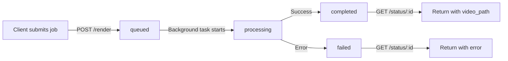

# Phase 2: State Management & Message Broker Setup

This guide walks you through setting up Upstash Redis for job state management and prepares your system for QStash message broker integration.

##  Phase 2 Overview

**Problem**: The stateless compute node forgets everything after rendering. Users need to know if their video is queued, processing, completed, or failed.

**Solution**: 
- **Upstash Redis**: Ephemeral state store for job tracking (7-day TTL)
- **Upstash QStash**: Serverless message broker for reliable task delivery (coming in Phase 3)

##  Quick Start

### Step 1: Create Upstash Account

1. Go to [https://upstash.com](https://upstash.com)
2. Sign up for a free account (no credit card required)
3. Verify your email

### Step 2: Create Redis Database

1. In the Upstash console, click **Create Database**
2. Choose:
   - **Name**: `manim-jobs` (or any name you prefer)
   - **Type**: Regional (free tier)
   - **Region**: Choose closest to your deployment location
   - **Eviction**: Default (allkeys-lru)
3. Click **Create**

### Step 3: Get Redis Credentials

After creating the database, you'll see:

```
REST API URL: https://YOUR-REDIS-URL.upstash.io
REST Token: YOUR-REDIS-TOKEN
```

**Important**: Copy both values - you'll need them for deployment.

##  Testing Locally (Without Docker)

### 1. Install Updated Dependencies

```powershell
# Activate virtual environment (if not already active)
cd C:\Users\mithr\Desktop\Manim
.\venv\Scripts\Activate.ps1

# Install new dependencies
cd manim-image
pip install -r requirements.txt
```

### 2. Set Environment Variables

**PowerShell (Windows)**:
```powershell
$env:UPSTASH_REDIS_REST_URL = "https://YOUR-REDIS-URL.upstash.io"
$env:UPSTASH_REDIS_REST_TOKEN = "YOUR-REDIS-TOKEN"

# Start server
uvicorn main:app --host 0.0.0.0 --port 7860 --reload
```

**Bash (Linux/Mac)**:
```bash
export UPSTASH_REDIS_REST_URL="https://YOUR-REDIS-URL.upstash.io"
export UPSTASH_REDIS_REST_TOKEN="YOUR-REDIS-TOKEN"

# Start server
uvicorn main:app --host 0.0.0.0 --port 7860 --reload
```

### 3. Verify Redis Connection

Check the startup logs for:
```
 Redis State Management: ENABLED
 Redis URL: https://YOUR-REDIS-URL...
```

If Redis is not configured, you'll see:
```
 Redis State Management: DISABLED (no credentials)
```

The service will still work, but status tracking won't be available.

### 4. Run Tests

```powershell
python test_api.py
```

Expected output:
```
 Root Endpoint: PASS
 Health Endpoint: PASS
 Simple Render: PASS
 Complex Render: PASS
 Invalid Quality: PASS
 Job Status (Phase 2): PASS
 Non-existent Job: PASS

Tests Passed: 7/7
```

##  Testing with Docker

### 1. Rebuild Docker Image

Since we updated `requirements.txt` and `main.py`, rebuild the image:

```powershell
cd C:\Users\mithr\Desktop\Manim\manim-image
docker build -t minimal-manim-worker .
```

### 2. Run Container with Redis Credentials

```powershell
docker run -d \
  -p 7860:7860 \
  -e UPSTASH_REDIS_REST_URL="https://YOUR-REDIS-URL.upstash.io" \
  -e UPSTASH_REDIS_REST_TOKEN="YOUR-REDIS-TOKEN" \
  --name manim-worker-phase2 \
  minimal-manim-worker
```

**Windows PowerShell** (multi-line):
```powershell
docker run -d `
  -p 7860:7860 `
  -e UPSTASH_REDIS_REST_URL="https://YOUR-REDIS-URL.upstash.io" `
  -e UPSTASH_REDIS_REST_TOKEN="YOUR-REDIS-TOKEN" `
  --name manim-worker-phase2 `
  minimal-manim-worker
```

### 3. Verify Container Logs

```powershell
docker logs manim-worker-phase2
```

Look for:
```
Phase 2 Features:
   Redis State Management: ENABLED
   Redis URL: https://YOUR-REDIS-URL...
```

### 4. Test Job Status Flow

**Submit a render job**:
```powershell
$body = @{
    code = "from manim import *`n`nclass TestScene(Scene):`n    def construct(self):`n        text = Text('Phase 2 Test')`n        self.play(Write(text))"
    scene_name = "TestScene"
    quality = "l"
} | ConvertTo-Json

$response = Invoke-RestMethod -Uri http://localhost:7860/render -Method Post -Body $body -ContentType "application/json"
$jobId = $response.job_id
Write-Host "Job ID: $jobId"
```

**Check job status** (immediately):
```powershell
Invoke-RestMethod -Uri "http://localhost:7860/status/$jobId"
```

Expected response:
```json
{
  "job_id": "uuid-here",
  "status": "queued",  // or "processing"
  "created_at": "2026-02-20T12:00:00.000000",
  "updated_at": "2026-02-20T12:00:00.000000",
  "scene_name": "TestScene",
  "quality": "l"
}
```

**Check again after 5-10 seconds**:
```powershell
Start-Sleep -Seconds 10
Invoke-RestMethod -Uri "http://localhost:7860/status/$jobId"
```

Expected response:
```json
{
  "job_id": "uuid-here",
  "status": "completed",
  "created_at": "2026-02-20T12:00:00.000000",
  "updated_at": "2026-02-20T12:00:05.000000",
  "video_path": "/tmp/media_uuid-here/videos/.../TestScene.mp4",
  "file_size": 12345,
  "scene_name": "TestScene",
  "quality": "l"
}
```

##  Job Status Lifecycle



### Status Values

| Status | Description | Redis Fields |
|--------|-------------|--------------|
| `queued` | Job accepted, waiting for processing | `job_id`, `status`, `created_at`, `scene_name`, `quality`, `code_length` |
| `processing` | Manim is currently rendering | All queued fields + `updated_at` |
| `completed` | Video generated successfully | All fields + `video_path`, `file_size` |
| `failed` | Rendering failed | All fields + `error`, `stderr` (truncated) |

**TTL**: All Redis keys expire after 7 days (604,800 seconds)

##  API Endpoints (Phase 2)

### New Endpoint: GET /status/{job_id}

**Purpose**: Query job status and results

**Request**:
```bash
GET http://localhost:7860/status/550e8400-e29b-41d4-a716-446655440000
```

**Response (Queued)**:
```json
{
  "job_id": "550e8400-e29b-41d4-a716-446655440000",
  "status": "queued",
  "created_at": "2026-02-20T12:00:00.000000",
  "updated_at": "2026-02-20T12:00:00.000000",
  "scene_name": "CircleScene",
  "quality": "l",
  "code_length": 195
}
```

**Response (Completed)**:
```json
{
  "job_id": "550e8400-e29b-41d4-a716-446655440000",
  "status": "completed",
  "created_at": "2026-02-20T12:00:00.000000",
  "updated_at": "2026-02-20T12:00:05.000000",
  "video_path": "/tmp/media_550e8400.../CircleScene.mp4",
  "file_size": 8373,
  "scene_name": "CircleScene",
  "quality": "l"
}
```

**Response (Failed)**:
```json
{
  "job_id": "550e8400-e29b-41d4-a716-446655440000",
  "status": "failed",
  "created_at": "2026-02-20T12:00:00.000000",
  "updated_at": "2026-02-20T12:00:05.000000",
  "error": "Render failed with exit code 1",
  "stderr": "SyntaxError: invalid syntax...",
  "scene_name": "BrokenScene"
}
```

**Error Responses**:

| Status Code | Meaning |
|-------------|---------|
| 404 | Job not found or expired (7-day TTL) |
| 503 | Redis not configured |
| 500 | Internal server error |

### Updated Endpoint: GET /

Now includes Redis status:

```json
{
  "service": "Manim Rendering Node",
  "phase": "Phase 2 - Compute Layer with State Management",
  "status": "operational",
  "redis_enabled": true,
  "endpoints": {
    "health": "/health",
    "render": "/render",
    "status": "/status/{job_id}"
  }
}
```

##  Troubleshooting

### Redis Connection Issues

**Error**: `Failed to initialize Redis client: ...`

**Solution**:
1. Verify credentials are correct
2. Check your Upstash dashboard for database status
3. Ensure your IP is not blocked (Upstash allows all IPs by default)
4. Test connection manually:
   ```python
   from upstash_redis import Redis
   redis = Redis(url="YOUR_URL", token="YOUR_TOKEN")
   redis.ping()  # Should return "PONG"
   ```

### Status Endpoint Returns 503

**Error**: `State management not available - Redis not configured`

**Cause**: Environment variables not set or Redis client failed to initialize

**Solution**:
1. Check if environment variables are set:
   ```powershell
   Get-ChildItem Env:UPSTASH_*
   ```
2. Restart server/container with correct credentials
3. Check startup logs for Redis initialization errors

### Job Status Returns 404

**Possible Causes**:
1. Job ID is incorrect (typo)
2. Job expired (7-day TTL)
3. Job was submitted before Redis was configured
4. Redis write failed silently (check logs)

**Solution**:
- Submit a new test job
- Check logs for `Redis status updated:` messages
- Verify Redis database is active in Upstash console

##  Monitoring Redis in Upstash Console

1. Go to your Upstash dashboard
2. Click on your `manim-jobs` database
3. Navigate to **Data Browser**
4. You'll see keys like:
   ```
   job:550e8400-e29b-41d4-a716-446655440000
   job:99ca2da6-8f12-4b02-b69f-e4a0a600baa3
   ```
5. Click any key to see its JSON value and TTL

**Pro Tip**: Use the **CLI** tab to run Redis commands:
```redis
KEYS job:*
GET job:550e8400-e29b-41d4-a716-446655440000
TTL job:550e8400-e29b-41d4-a716-446655440000
```

##  Next Steps

- **Phase 3**: Integrate QStash message broker for reliable task delivery
- **Phase 4**: Add video storage (Cloudflare R2) and return public URLs
- **Phase 5**: Build frontend + LLM prompt engineering

##  Resources

- [Upstash Redis Documentation](https://upstash.com/docs/redis)
- [upstash-redis Python SDK](https://github.com/upstash/redis-py)
- [FastAPI Background Tasks](https://fastapi.tiangolo.com/tutorial/background-tasks/)

---

**Questions or issues?** Check the main [README.md](README.md) or create an issue.
